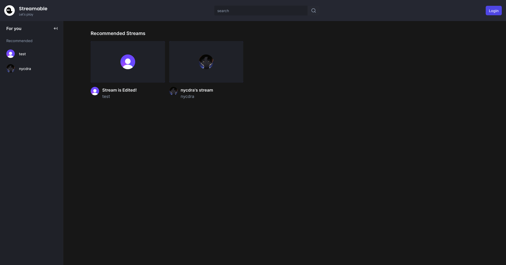
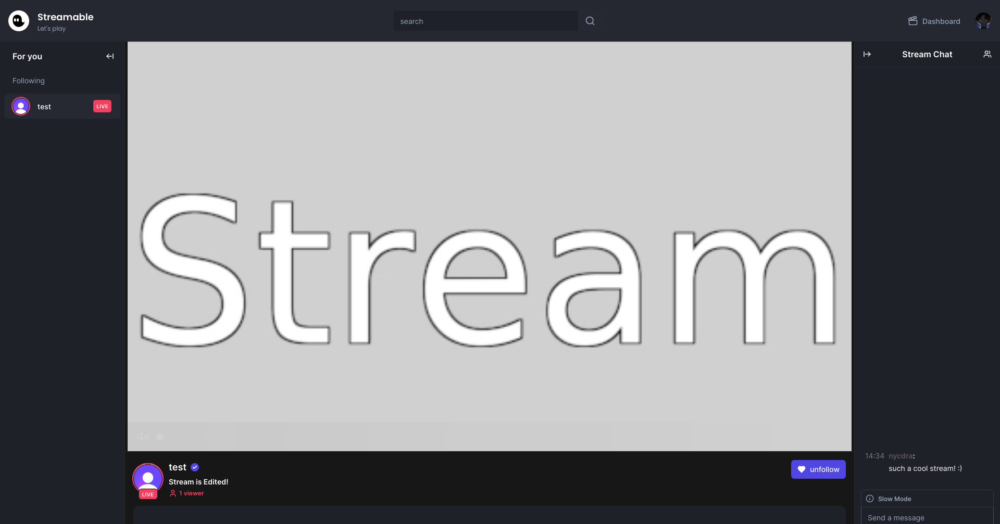
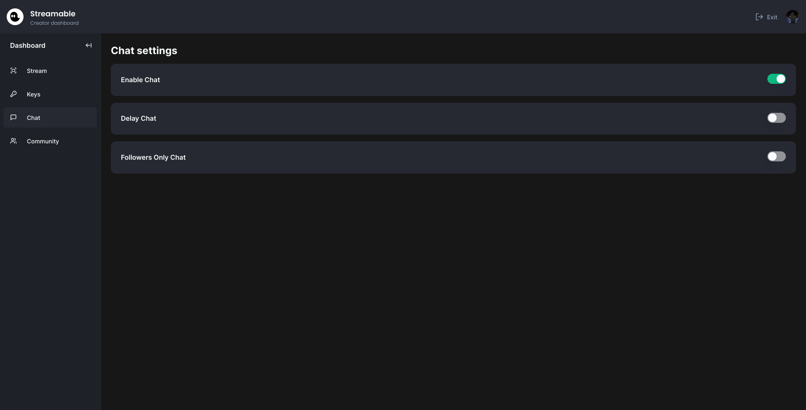
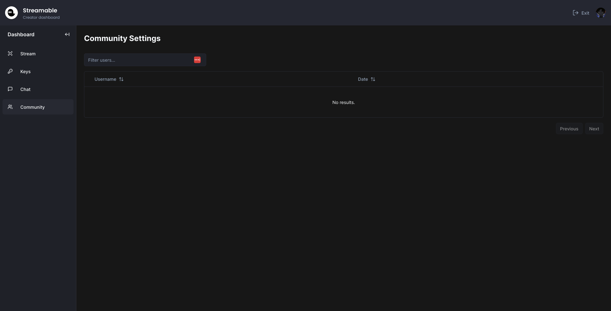

# Streambable

A replica of your favorite streaming website!

## Why?

A website I made for learning more about building complex websites using different technologies and also just for fun :)

## Features

- PlanetScale database to store your accounts
- Clerk for a better login experience
- Create a stream with your favorite streaming program.
- Follow accounts that you like.
- Ability to comment on a stream’s online and offline chat.
- Ability to add a thumbnail to your own stream.
- Ability to add a bio to your profile.
- Ability to ban and unban users.
- Ability to change your stream name.

## Pictures

